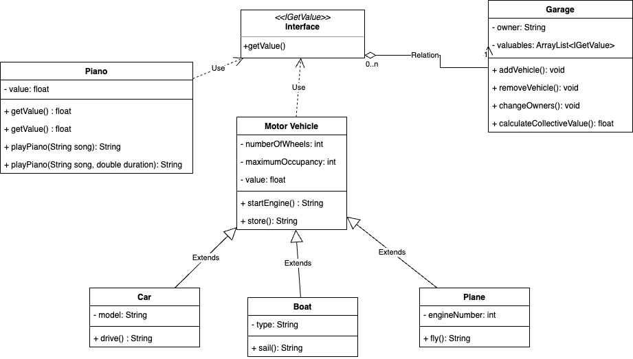
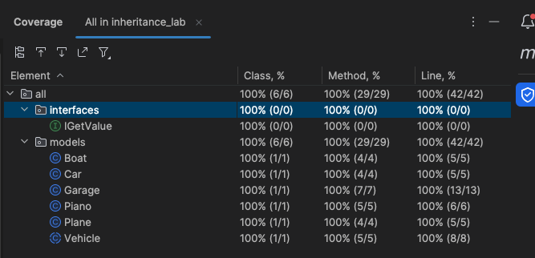

# Week 3 Lab: Polymorphism

For this lab we were tasked to make use of the core concepts of polymorphism.

I chose to theme this project around vehicles and how they can be stored in a garage.

Here is the UML Diagram for this project:

## Tasks

### Minimum viable product:

- [x] Create a new project, with multiple classes 
  * Project has Car, Boat, Plane classes
- [x] Create an abstract class
    * Project has abstract class Vehicle
- [x] Extend the abstract class with at least 2 sub-classes
    * Vehicle class has Car, Boat and Plane as subclasses
- [x] Create a collection which accepts objects of either of those 2 types
    * Garage class has ArrayList of IGetValue types

### Extensions:

- [x] Implement at least 1 method overload
    * Piano class has playPiano(song) overloaded by playPiano(song, duration)
- [x] Define an abstract method in the super-class and implement it in each of the sub-classes
    * Abstract class Vehicle has abstract method startEngine() which is implemented in Car, Boat and Plane
- [x] Create an interface and implement it on at least 1 class
    * Interface IGetValue relates all classes that contain the getValue() method

## Tests

This project was created using test driven development and has 100% code coverage.

